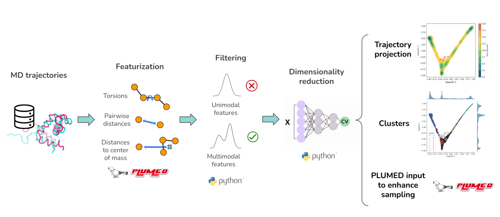

Deep Cartograph
===============


Deep cartograph is a package to analyze and enhance MD simulations. This software has been developed for the [European BioExcel](http://bioexcel.eu/), funded by the European Commission (EU Horizon Europe [101093290](https://cordis.europa.eu/project/id/101093290)).

---

Deep cartograph can be used to train different collective variables from simulation data. Either to analyze existing trajectories or to use them to enhance the sampling in subsequent simulations. It leverages PLUMED to compute the features and the [mlcolvar](https://github.com/luigibonati/mlcolvar.git) library to train the different collective variables [1](https://pubs.aip.org/aip/jcp/article-abstract/159/1/014801/2901354/A-unified-framework-for-machine-learning?redirectedFrom=fulltext).

Starting from a trajectory and topology files, Deep cartograph can be used to:

  1. Featurize the trajectory into a lower dimensional space invariant to rotations and translations.
  2. Filter the features.
  3. Compute and train different collective variables (CVs) using the filtered features.
  4. Project and cluster the trajectory in the CV space.
  5. Produce a PLUMED input file to enhance the sampling.



---


### Project structure

- **deep_cartograph**: contains all the tools and modules that form part of the deep_cartograph package.
- **examples**: contains examples of how to use the package.

## Installation

Using conda, create the deep cartograph environment from the `environment.yml` or `environment_detailed.yml` files.

```
git clone https://github.com/NBDsoftware/deep_cartograph.git
cd deep_cartograph
conda env create -f environment_detailed.yml
```

The `environment_detailed.yml` file has been produced using `conda env export --no-builds -f environment_detailed.yml` and should be cross-platform compatible. 
Otherwise try to create the environment from `environment.yml`.

Activate the environment and install the deep cartograph package itself.

```
cd deep_cartograph
pip install .
```

If you are a developer you can install it in editable mode:

```
pip install -e .
```

In this way changes in this working directory will be reflected on the environment.

If you want to use GPU support be sure to install the environment in the machine that has an available GPU. In a cluster for example you can connect with an interactive session to the computation node and perform the installation there. In this way conda will install the necessary dependencies to have gpu support. 

## Usage

The main workflow can be used calling `deep_carto` within the environment:

```
usage: Deep Cartograph [-h] -conf CONFIGURATION_PATH -traj_data TRAJECTORY_DATA -top_data TOPOLOGY_DATA [-sup_traj_data SUPPLEMENTARY_TRAJ_DATA] [-sup_top_data SUPPLEMENTARY_TOP_DATA]
                       [-ref_top REFERENCE_TOPOLOGY] [-restart] [-dim DIMENSION] [-cvs CVS [CVS ...]] [-out OUTPUT_FOLDER] [-v]

Map trajectories onto Collective Variables.

options:
  -h, --help            show this help message and exit
  -conf CONFIGURATION_PATH, -configuration CONFIGURATION_PATH
                        Path to configuration file (.yml).
  -traj_data TRAJECTORY_DATA
                        Path to trajectory or folder with trajectories to analyze. Accepted formats: .xtc .dcd .pdb .xyz .gro .trr .crd.
  -top_data TOPOLOGY_DATA
                        Path to topology or folder with topology files for the trajectories. If a folder is provided, each topology should have the same name as the corresponding
                        trajectory in -traj_data. Accepted format: .pdb.
  -sup_traj_data SUPPLEMENTARY_TRAJ_DATA
                        Path to supplementary trajectory or folder with supplementary trajectories. Used to project onto the CV alongside 'trajectory_data' but not for computing CVs.
  -sup_top_data SUPPLEMENTARY_TOP_DATA
                        Path to supplementary topology or folder with supplementary topologies. If a folder is provided, each topology should match the corresponding supplementary
                        trajectory in -sup_traj_data.
  -ref_top REFERENCE_TOPOLOGY
                        Path to reference topology file. Used to find features from user selections. Defaults to the first topology in topology_data. Accepted format: .pdb.
  -restart              Restart workflow from the last finished step. Deletes step folders for repeated steps.
  -dim DIMENSION, -dimension DIMENSION
                        Dimension of the CV to train or compute. Overrides the configuration input YML.
  -cvs CVS [CVS ...]    Collective variables to train or compute (pca, ae, tica, htica, deep_tica). Overrides the configuration input YML.
  -out OUTPUT_FOLDER, -output OUTPUT_FOLDER
                        Path to the output folder.
  -v, -verbose          Set logging level to DEBUG.

```

An example for the YAML configuration file can be found here `deep_cartograph/default_config.yml`.

**PLUMED interface**: the resulting Deep Learning CVs can be deployed for enhancing sampling with the [PLUMED](https://www.plumed.org/) package via the [pytorch](https://www.plumed.org/doc-master/user-doc/html/_p_y_t_o_r_c_h__m_o_d_e_l.html>`_) interface, available since version 2.9. 

## FAQ

**Error in LatticeReduction.cpp when using a trajectory from AMBER**

```
(tools/LatticeReduction.cpp:42) static void PLMD::LatticeReduction::sort(PLMD::Vector*)
+++ assertion failed: m[1]<=m[2]*onePlusEpsilon
```

This is related to how PLUMED reads the lattice vector information from the input files. Might be a problem specific to AMBER, see [discussion](https://groups.google.com/g/plumed-users/c/k6QoUu5LGoE/m/uzt4VGooCAAJ?utm_medium=email&utm_source=footer). In some cases it can be solved **converting the trajectory to pdb format** and then **erasing the CRYST record**. Otherwise try to change the PLUMED version or convert the trajectory to a different format. 

## Licensing

This project is offered under a dual-license model, intended to make the software freely available for academic and non-commercial use while preventing its use for profit.

### 1. Academic and Non-Commercial Use

For academic, research, and other non-commercial purposes, this software is licensed under the **Creative Commons Attribution-NonCommercial-ShareAlike 4.0 International (CC BY-NC-SA 4.0)**.

Under this license, you are free to:
*   **Share** — copy and redistribute the material in any medium or format.
*   **Adapt** — remix, transform, and build upon the material.

As long as you follow the license terms:
*   **Attribution** — You must give appropriate credit.
*   **Non-Commercial** — You may not use the material for commercial purposes.
*   **Share-Alike** — If you remix, transform, or build upon the material, you must distribute your contributions under the same license as the original.

A full copy of the license is available in the [LICENSE](LICENSE) file in this repository.

### 2. Commercial Use

**Use of this software for commercial purposes is not permitted under the CC BY-NC-SA 4.0 license.**

If you wish to use this software in a commercial product, for-profit service, or any other commercial context, you must obtain a separate commercial license.

Please contact **it@nostrumbiodiscovery.com** to inquire about purchasing a commercial license.

