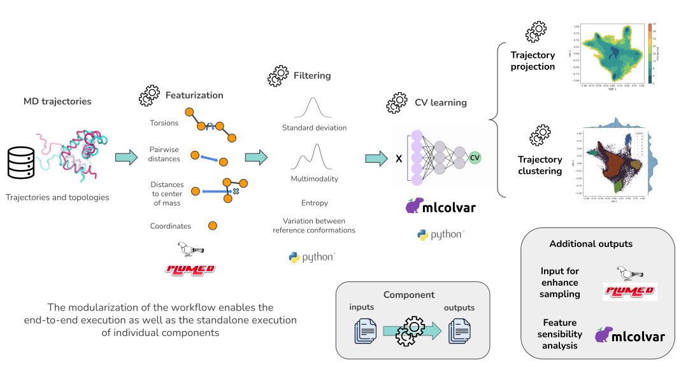

Deep Cartograph
===============

[](https://nbdsoftware.github.io/deep_cartograph/)
[](LICENSE)


Deep cartograph is a package to analyze and enhance MD simulations.

This software has been developed for the [European BioExcel](http://bioexcel.eu/), funded by the European Commission (EU Horizon Europe [101093290](https://cordis.europa.eu/project/id/101093290)).

---

Deep cartograph can be used to train different collective variables from simulation data. Either to analyze existing trajectories or to use them to enhance the sampling in subsequent simulations. It leverages PLUMED to compute the features and the [mlcolvar](https://github.com/luigibonati/mlcolvar.git) library to train the different collective variables [1](https://pubs.aip.org/aip/jcp/article-abstract/159/1/014801/2901354/A-unified-framework-for-machine-learning?redirectedFrom=fulltext).

Starting from a trajectory and topology files, Deep cartograph can be used to:

  1. Featurize the trajectory.
  2. Filter the features.
  3. Compute and train different collective variables (CVs).
  4. Project and cluster the trajectory in the CV space.
  5. Produce a PLUMED input file to enhance the sampling.



---


### Project structure

- **deep_cartograph**: contains all the tools and modules that form part of the deep_cartograph package.
- **examples**: contains examples of how to use the package.

## Documentation

Full documentation, including one page per tool, is at **https://nbdsoftware.github.io/deep_cartograph/**.

## Installation

```
git clone https://github.com/NBDsoftware/deep_cartograph.git
cd deep_cartograph
conda env create -f environment_detailed.yml
conda activate deep_cartograph
pip install .
```

See the [installation guide](https://nbdsoftware.github.io/deep_cartograph/installation.html) for GPU support and development installs.

## Usage

Run the full workflow with `deep_carto`:

```
deep_carto -conf config.yml -traj_data trajectories/ -top_data topologies/ -out output/
```

An example YAML configuration file is in `deep_cartograph/default_config.yml`. Each step is also available as a standalone tool (`compute_features`, `train_colvars`, ...); see the [tools list](deep_cartograph/tools/README.md) and the [documentation](https://nbdsoftware.github.io/deep_cartograph/) for all options.

Common problems are covered in the [FAQ](https://nbdsoftware.github.io/deep_cartograph/faq.html).

## Citing

If you use Deep Cartograph, please cite it using the metadata in [CITATION.cff](CITATION.cff), or GitHub's "Cite this repository" button. Changes between versions are listed in the [CHANGELOG](CHANGELOG.md).

## Licensing

This project is offered under a dual-license model, intended to make the software freely available for academic and non-commercial use while preventing its use for profit.

### 1. Academic and Non-Commercial Use

For academic, research, and other non-commercial purposes, this software is licensed under the **Creative Commons Attribution-NonCommercial-ShareAlike 4.0 International (CC BY-NC-SA 4.0)**.

Under this license, you are free to:
*   **Share** — copy and redistribute the material in any medium or format.
*   **Adapt** — remix, transform, and build upon the material.

As long as you follow the license terms:
*   **Attribution** — You must give appropriate credit.
*   **Non-Commercial** — You may not use the material for commercial purposes.
*   **Share-Alike** — If you remix, transform, or build upon the material, you must distribute your contributions under the same license as the original.

A full copy of the license is available in the [LICENSE](LICENSE) file in this repository.

### 2. Commercial Use

**Use of this software for commercial purposes is not permitted under the CC BY-NC-SA 4.0 license.**

If you wish to use this software in a commercial product, for-profit service, or any other commercial context, you must obtain a separate commercial license.

Please contact **it@nostrumbiodiscovery.com** to inquire about purchasing a commercial license.

